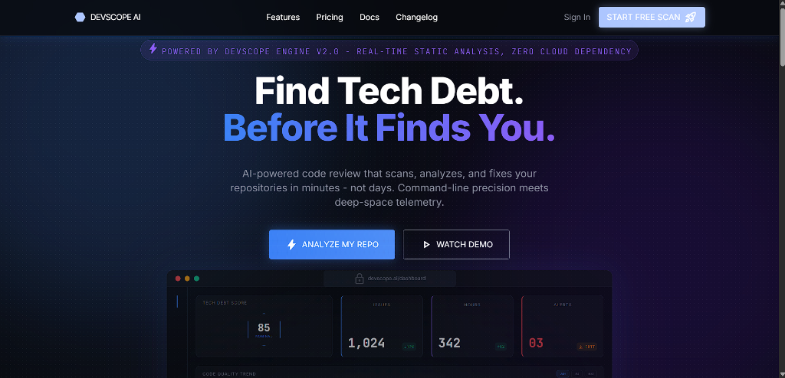
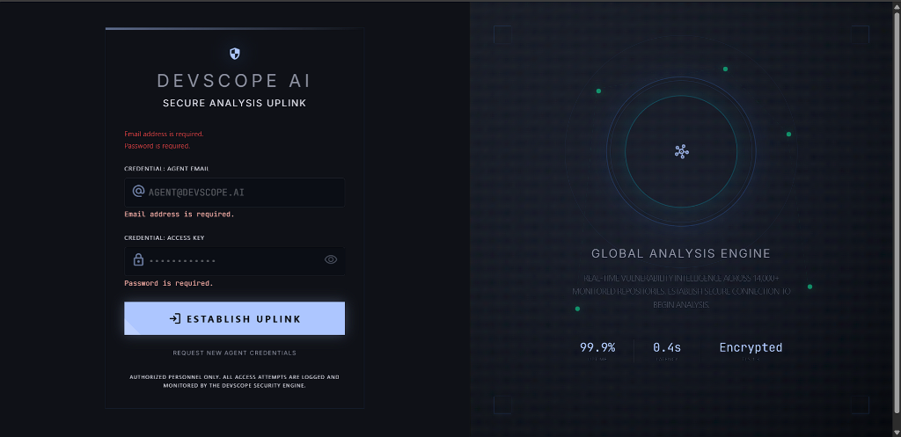
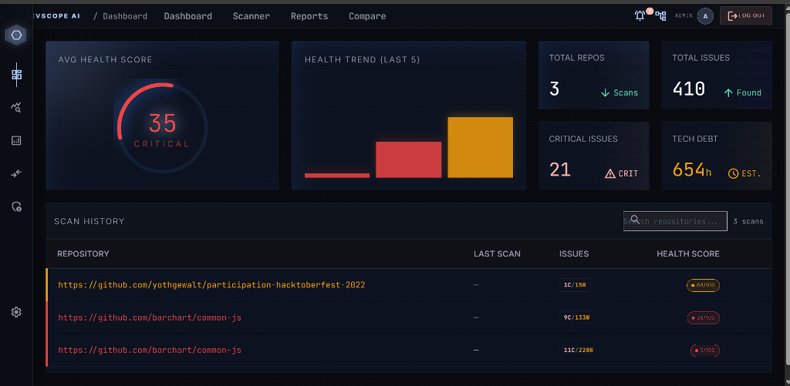
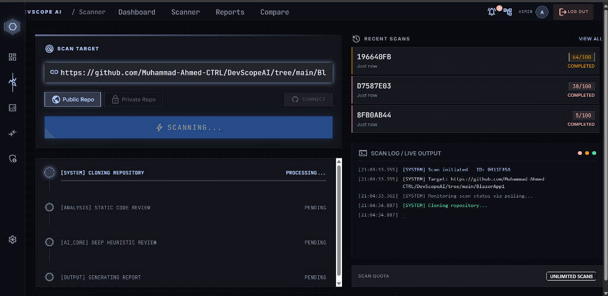
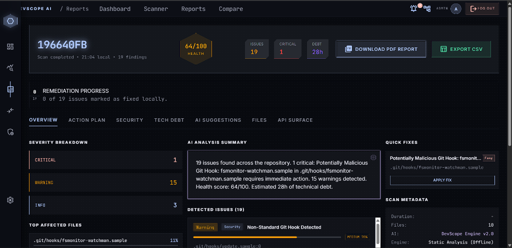
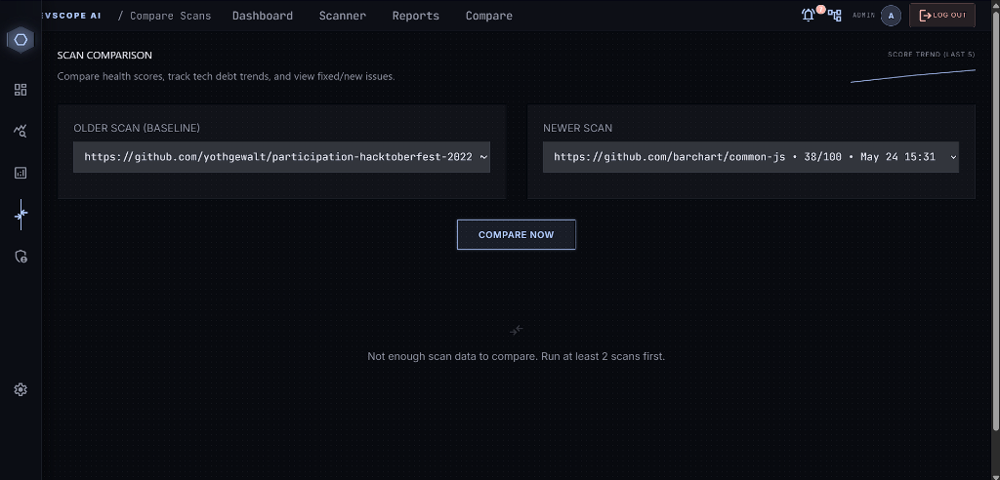
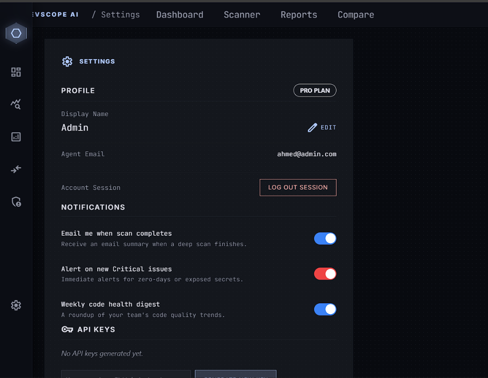
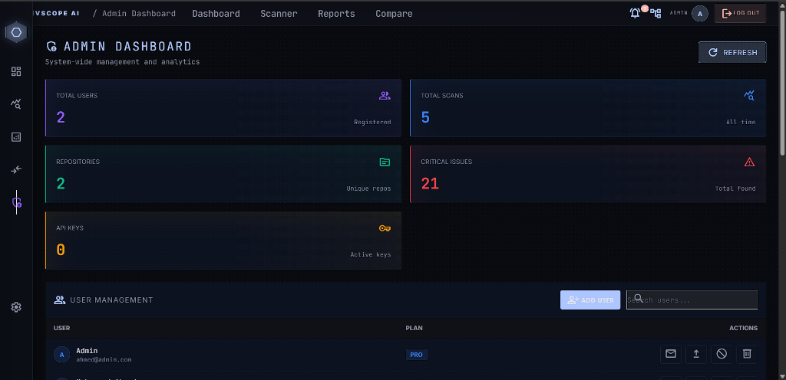
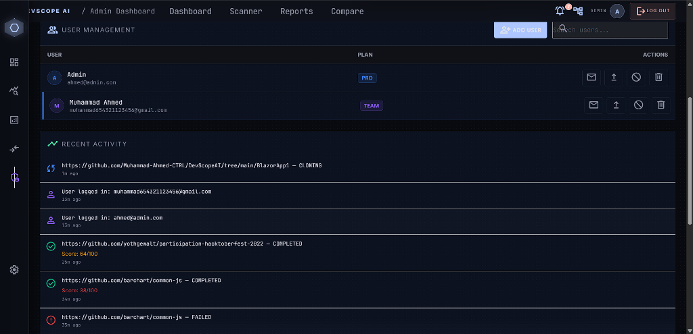
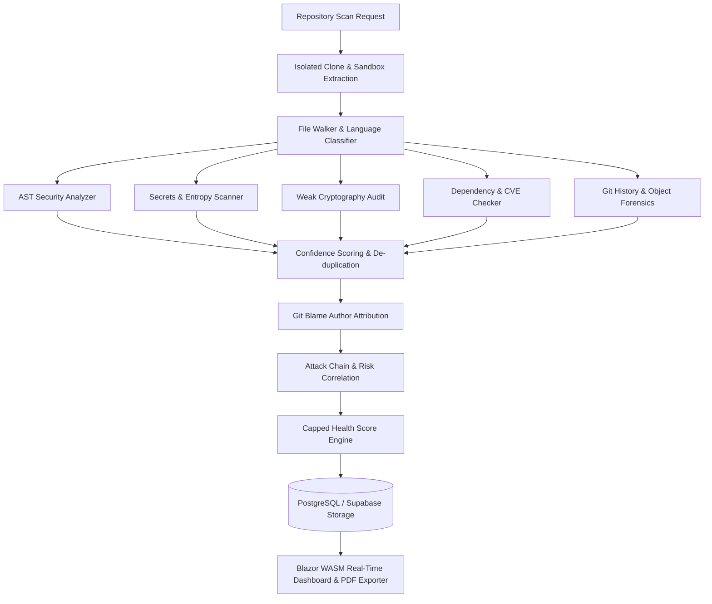

# 🛡️ CodeSentry AI — Intelligent Source Code Security & Vulnerability Analysis Platform

> **CY3741 — Internship Project**  
> **Student:** Piruthvivelraj K S (Reg No: 142223128031)  
> **Department:** Department of Cyber Security, SRM Valliammai Engineering College  
> **Host Organization:** TVK Technologies  
> **Domain:** Cybersecurity, DevSecOps & Automated Static Application Security Testing (SAST)

---

## 📌 Executive Summary

**CodeSentry AI** is a state-of-the-art static application security testing (SAST) and code intelligence platform engineered to protect enterprise source code repositories. Built with a high-throughput **.NET 10 Web API** backend, a responsive **Blazor WebAssembly** security operations dashboard, and synchronized cloud storage via **Supabase**, it automates the detection of critical security vulnerabilities, hardcoded secrets, weak cryptographic primitives, and architectural technical debt.

---

## 📸 Platform Showcase & Interface Tour

### 1. 🌐 Landing & Uplink Authentication
- **Landing Gateway:** Highlights live AI code review summaries, active security telemetry, and metric overview cards.
- **Terminal Authentication:** Interactive cybersecurity terminal node offering secure JWT-based access control and multi-role authorization.

| Landing Page Preview | Secure Terminal Authentication |
| :---: | :---: |
|  |  |

### 2. 📈 Central Security Dashboard & Live Scanner
- **Security Dashboard:** Features real-time repository health gauges, historical scan vulnerability trends, tech-debt calculations, and risk posture metrics.
- **Live Terminal Scanner:** Real-time terminal emulation for Git repository cloning, dynamic AST generation, file inspection, and streaming pipeline logs.

| Dashboard Overview | Live Scanner Terminal |
| :---: | :---: |
|  |  |

### 3. 🛡️ Deep Vulnerability Reports & Scan Comparison
- **Deep Audit Reports:** Comprehensive breakdown categorized by OWASP Top 10 / CWE risk ratings, code snippets, remediation playbooks, and exportable PDF/CSV reports.
- **Historical Scan Comparison:** Differential delta engine comparing base vs. target commits to identify newly introduced vulnerabilities and verify patched flaws.

| Deep Analysis Reports | Scan Comparison & Delta Tracking |
| :---: | :---: |
|  |  |

### 4. 🔑 Administrative Governance & Preferences
- **System Administration:** Platform monitoring, role-based access control (Free, Pro, Team tiers), user lifecycle suspension, and global telemetry.
- **Settings & CI/CD API Keys:** Secure profile management, automated notification webhooks, and granular API tokens for CI/CD pipeline integration.

| Settings & Security Preferences | System Admin Dashboard |
| :---: | :---: |
|  |  |

| User Roster & Platform Activity |
| :---: |
|  |

---

## 🏗️ System Architecture & Workflow Pipeline



---

## 🚀 Key Functional Modules

### 1. 🔍 High-Precision Static Security Analyzers
- **OWASP Vulnerability Engine:** Detects Command Injection, SQL Injection, Cross-Site Scripting (XSS), Path Traversal, and SSRF.
- **Cryptographic Health Inspector:** Flags outdated hashing (MD5, SHA-1), insecure ciphers (DES, RC4), and non-cryptographic RNG seeds.
- **Entropy Secrets Detection:** Analyzes Shannon entropy and regex signatures to uncover leaked API tokens (AWS, GitHub, Slack, OpenAI) across Git commit histories.
- **Software Composition Analysis (SCA):** Flags vulnerable or deprecated third-party packages.

### 2. 🧮 Capped Scoring & Author Attribution
- **Non-Linear Health Algorithm:** Uses weighted vulnerability caps to ensure minor code-quality or informational warnings do not unrealistically penalize repositories.
- **Git Forensics Attribution:** Enriches every security finding with author commit details, commit SHAs, and timestamp records.

### 3. ⚖️ Enterprise Rate-Limiting & Concurrency Control
- Employs SemaphoreSlim-based throttling (3 concurrent enterprise scans max) and IP-based rate limiting to prevent Denial of Service (DoS) attacks on the analysis engine.

---

## 🛠️ Project Structure

```text
CodeSentry_AI_Platform/
├── CodeSentry.API/            # ASP.NET Core 10 Web API Backend & SAST Engine
│   ├── Auth/                  # JWT & Role-Based Authorization Handlers
│   ├── Controllers/           # REST API Endpoints (Scan, Repo, User, Admin)
│   ├── Data/                  # Entity Framework Core DbContext & Migrations
│   ├── Models/                # Data Entities, DTOs & Vulnerability Models
│   ├── Services/              # Roslyn AST, File Walker, PDF Exporters
│   │   └── Analyzers/         # Specialized Static Analyzers & Entropy Scanners
│   ├── Dockerfile             # Container deployment descriptor
│   └── Program.cs             # API bootstrapping & DI container configuration
├── CodeSentry.Client/         # Blazor WebAssembly Frontend SPA
│   ├── Layout/                # Navbars, Sidebars & Master Layouts
│   ├── Pages/                 # Dashboard, Scanner, Reports, Admin, Settings
│   ├── Services/              # State management & Interop bridges
│   ├── Shared/                # Reusable UI components & metrics cards
│   └── wwwroot/               # Static assets, Tailwind CSS & JS interop
├── assets/                    # Screenshots & architectural diagrams
├── CodeSentry.sln             # Visual Studio Solution File
├── CodeSentry.slnx            # Modern XML Solution File
└── supabase_schema.sql        # Database initialization schema
```

---

## 💻 Local Setup & Execution Guide

### 1. Prerequisites
- [.NET 10 SDK / .NET 8+](https://dotnet.microsoft.com/download)
- [Git CLI](https://git-scm.com/)
- [Supabase Project](https://supabase.com/) (Optional for cloud sync, local SQLite supported)

### 2. Backend Execution (`CodeSentry.API`)
```bash
cd CodeSentry.API
dotnet restore
dotnet run
```
API runs on `https://localhost:7082` (Swagger UI available at `/swagger`).

### 3. Frontend Execution (`CodeSentry.Client`)
```bash
cd CodeSentry.Client
dotnet restore
dotnet run
```
Blazor WebAssembly client will launch on `https://localhost:7166`.

---

## 📄 License & Academic Attribution
Developed as part of the **CY3741 — Internship** curriculum under the **Department of Cyber Security, SRM Valliammai Engineering College** in partnership with **TVK Technologies**.
